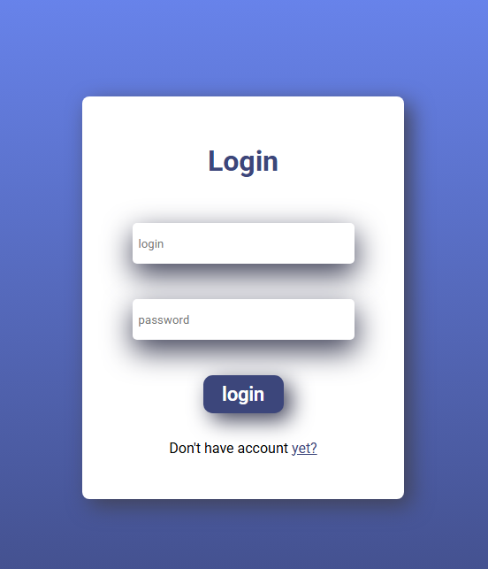
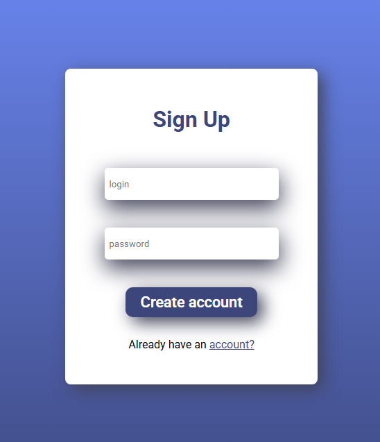
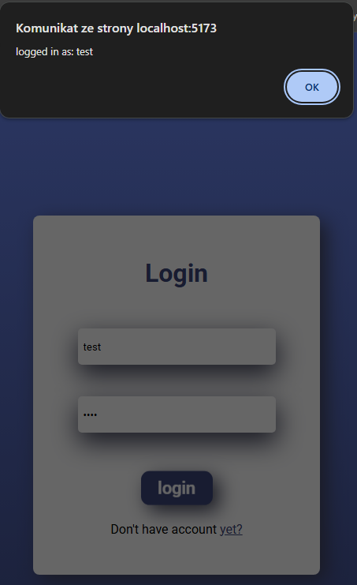

# Login & Signup System
Prosty system logowania i rejestracji użytkowników zbudowany w React.
### 📋 Opis projektu
Aplikacja umożliwia użytkownikom:

Tworzenie nowych kont z unikalnym loginem i hasłem
Logowanie się na istniejące konta
Walidację dostępności loginu podczas rejestracji
Przełączanie się między formularzami logowania i rejestracji

### 🚀 Funkcjonalności

Rejestracja: Tworzenie nowego konta z automatycznym sprawdzaniem dostępności loginu
Logowanie: Weryfikacja danych logowania i dostęp do konta
Walidacja: Sprawdzanie czy login jest już zajęty
Responsywny design: Interfejs dostosowuje się do różnych rozdzielczości ekranu
Animacje: Płynne przejścia i efekty hover dla lepszego UX

### 🛠️ Technologie

React 18
JavaScript (ES6+)
CSS3
Vite

### 📦 Instalacja

Sklonuj repozytorium:
```
git clone https://github.com/GracjanHajdasz/login.git
```
Przejdź do folderu projektu:
```
cd login
```
Zainstaluj zależności:
```
npm install
```
Uruchom projekt:
```
npm run dev
```

## 🖼️ Zrzuty ekranu

### Ekran logowania


### Ekran rejestracji


### Walidacja loginu (login zajęty)


### Pomyślne logowanie


## 📁 Struktura projektu
```
LOGIN/
├── frontend/
│   ├── node_modules/
│   ├── public/
│   ├── src/
│   │   ├── assets/
│   │   ├── components/
│   │   │   ├── Login.css
│   │   │   ├── Login.jsx
│   │   │   └── Signup.jsx
│   │   ├── App.css
│   │   ├── App.jsx
│   │   ├── index.css
│   │   └── main.jsx
│   ├── .gitignore
│   ├── eslint.config.js
│   ├── index.html
│   ├── package-lock.json
│   ├── package.json
│   ├── vite.config.js
│   └── README.md
├── screenshots/
│   ├── login.png
│   ├── signup.png
│   ├── login-taken.png
│   └── successful-login.png
└── README.md
```

## 💡 Jak używać

1. **Rejestracja nowego użytkownika:**
   - Kliknij "yet?" na ekranie logowania
   - Wprowadź unikalny login i hasło
   - Kliknij "Create account"

2. **Logowanie:**
   - Wprowadź swój login i hasło
   - Kliknij "login"
   - Po pomyślnym zalogowaniu zobaczysz komunikat powitalny

## 🔒 Uwagi dotyczące bezpieczeństwa

⚠️ **Projekt edukacyjny** - Ta aplikacja przechowuje dane tylko w pamięci przeglądarki i nie powinna być używana w środowisku produkcyjnym. W prawdziwej aplikacji należy:
- Używać backendu do przechowywania danych użytkowników
- Hashować hasła (np. bcrypt)
- Implementować tokeny JWT do autoryzacji
- Używać HTTPS
- Dodać walidację po stronie serwera

## 🤝 Wkład w projekt

Pull requesty są mile widziane! Jeśli chcesz wprowadzić większe zmiany, otwórz najpierw issue, aby omówić proponowane zmiany.

## 📝 Licencja

[MIT](https://choosealicense.com/licenses/mit/)
